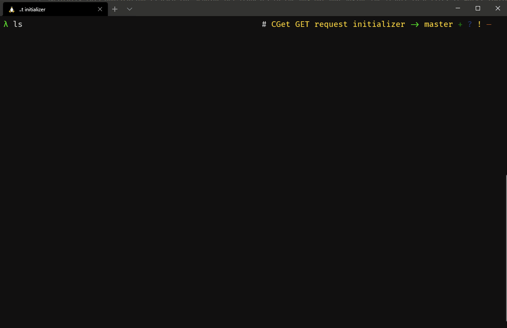
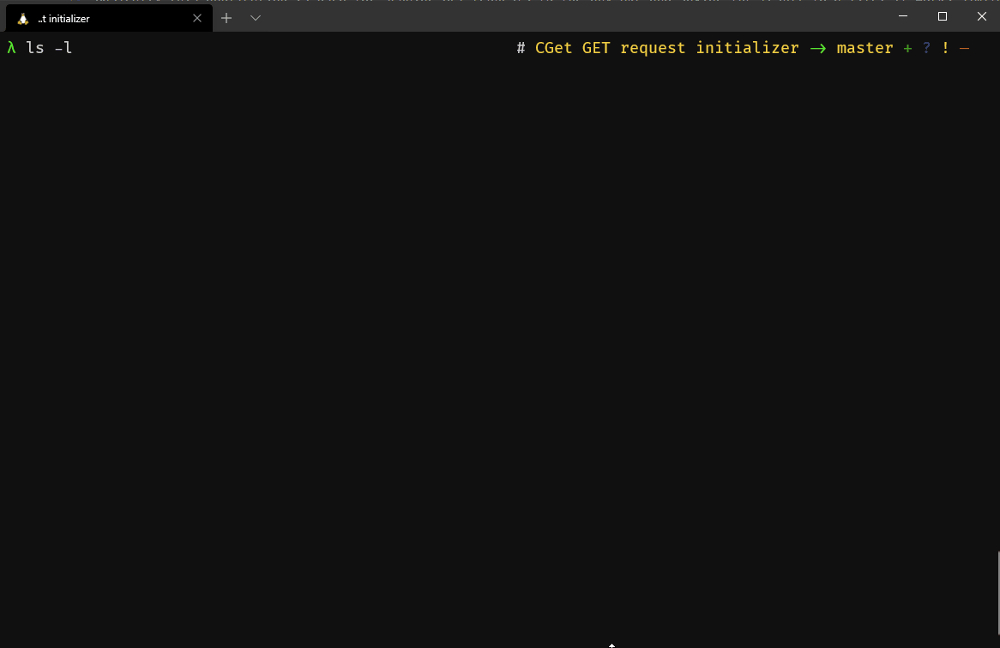

# Client-Side GET (CGet) Request Sender 
## Summary
Basically this application is used for sending GET requests to the any URL and saving the result to a file. It works similarly in spirit with cURL and Wget.

## Construction
Its basically uses Python's `requests` library for sending the GET request from the server. Then the response it handled in various ways that the user has control over. User can see, store or even jsonify the data and do the both again with it.

## Features
1. It can display the HTML or JSON content of any webpage that supports GET request.
2. It can save that result into a file of your choice or identify that its a file from the URL and save it accordingly if `--file` flag is passed.
3. It can send GET API calls to servers and fetch/store their content.
4. It also has a handy ProgressBar that is customizable and can be changed aesthetically. [Progress PYPI]([https://link](https://pypi.org/project/progress/))

## Usage
`Usage: python3 cget <url> <mode (--file or --json or --print)> <filename (optional)>`

### Samples
- `python3 cget.py https://www.google.com/ --file google-clone.html` (This clones the HTML content of the Google page)

- `python3 cget.py http://worldtimeapi.org/api/timezone/America/Argentina/Salta --json Argentina-time.json` (If the filename is not provided it will be outputted to STDOUT ie. Console)

- `python3 cget.py http://www.youtube.com --print` (This will output the HTML content of the YouTube homepage to the STDOUT or the console)

## Installation
To install you can use the following command 

    git clone https://github.com/ShaderOX/CGet.git
----------
### Dependencies
    pip3 install -r requirements.txt  